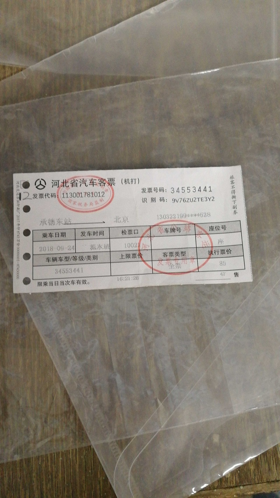
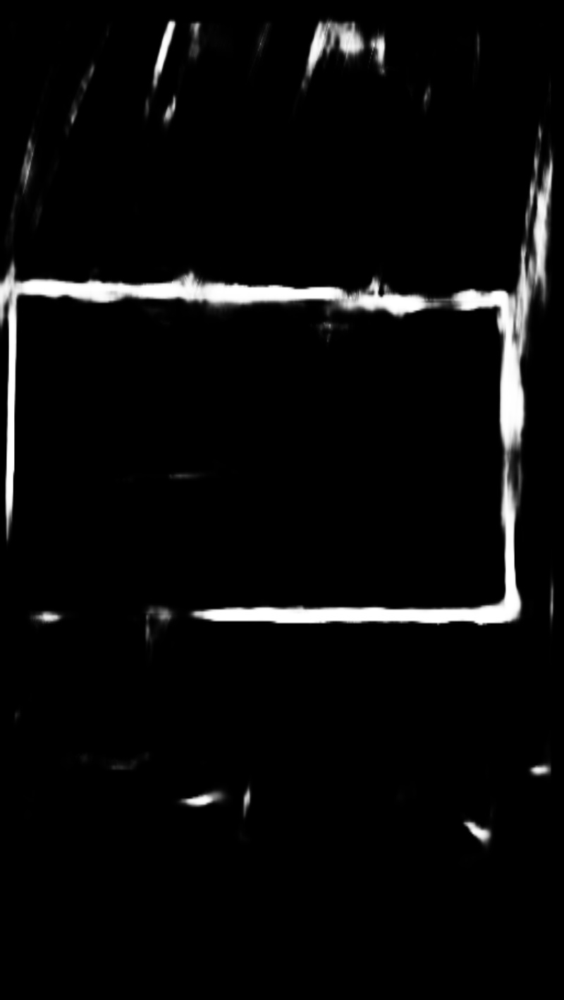
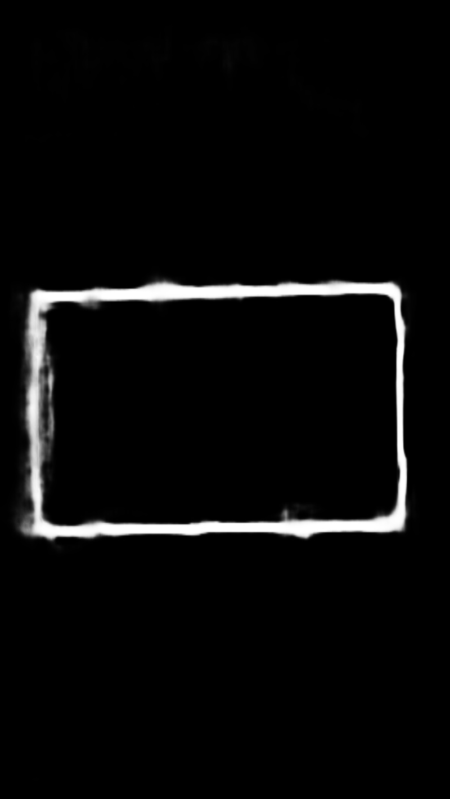

# A Pytorch Implementation of HED for Document Detection

### Introduction
This project is a Pytorch implementation of HED algorithm([Holistically-Nested Edge Detection](https://arxiv.org/abs/1504.06375)) for document detection. The features are summarized blow:

- It is pure Pytorch code.
- It can automatically generate training samples to train the HED.


Some examples are shown bellow.
- Similar colors of the document and background:
 

   

- The results are better when there is a clear distinction between foreground and background:

   


### Contents
[TOC]
### Requirements
- python3
- Any version of Pytorch version > 1.0 should be ok

### Demo
Downloaded the trained model:
- Baidu Cloud Disk: [Download ](https://pan.baidu.com/s/1bVM_38M-GIkS7tSHslXAHw)     Password: `rb3r`

 and put it in `./savecheckpoint` run

```
python testHED.py --testImgPath=./demo \
--saveOutPath=./demoout \
--checkpointPath=./savecheckpoint/58000_net.pkl \
--gpu_list=2
```
The result edge image  will be then written to the saveOutPath path.

### Train
We have implemented two training methods to train HED document detection.
- Train without annotated data
- Train with annotated data 


#### Train without annotated data
 This implementation of HED  document detection can be trained  without any annotated data, except a set of foreground images and a set of background images

Put the foreground images to  `./DATASET/source_image/foreground_images/`
Put the background images to  `./DATASET/source_image/background_images/`
Some validation images should be provided in  `./DATASET/dataset/testData/`
```
python trainHED_Online.py --fgpath=./DATASET/source_image/foreground_images/ \
--bgpath=./DATASET/source_image/background_images/ \
--test_data_dir=./DATASET/dataset/testData/ \
--SaveCheckpointPath= ./saveModelTrainedOnline \
--SaveOutImgPath=./saveImgTrainedOnline \
--gpu_list=2
```


#### Train with data saved on the hard disk
- To train the model with your dataset, just provide the dataset by a .CSV file which include the image and the groundtruth pairs, see [HED_Dataset.csv](./DATASET/dataset/HED_Dataset.csv) for an example. We provide a script for geting the .csv file  [./tools/createDatasetListCSV.py](./tools/createDatasetListCSV.py).
- Annotated images for training HED model are difficult to obtain. A script to generate training samples is provided, see [./tools/generate_data.py](./tools/generate_data.py) for more details.  An example of a pair of image and the groundtruth is shown bellow:


  


```
python trainHED.py --train_csv_file=./DATASET/dataset/HED_Dataset.csv \
--test_data_dir=./DATASET/dataset/testData \
--rootdir=./DATASET/dataset/ \
--SaveCheckpointPath= ./saveModelTrainedOnline \
--SaveOutImgPath=./saveImgTrainedOnline \
--gpu_list=2
```


